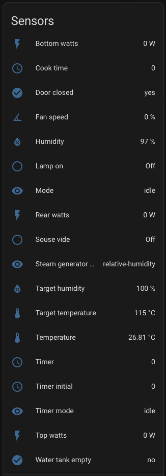
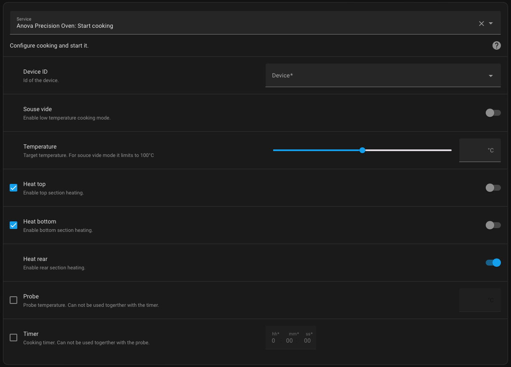
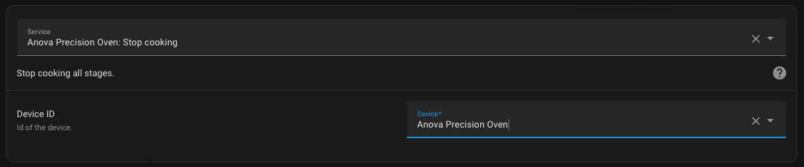
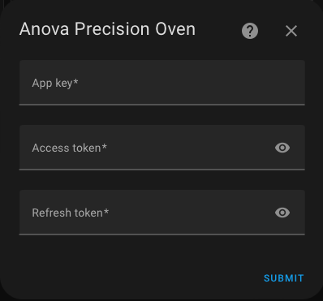

# Anova Oven HA integration

[![GitHub Release][releases-shield]][releases]
[![GitHub Activity][commits-shield]][commits]
[![License][license-shield]](LICENSE)
[![BuyMeCoffee][buymecoffeebadge]][buymecoffee]

This integration relies on the reverse engineering of the Anova Precision Oven WebSocket API as implemented in this project. https://github.com/bogd/anova-oven-api/tree/main

**This integration will set up the following sensors and services.**

Sensors

Services

1. Start cooking
    
1. Stop cooking
    

## Installation

### Install from HACS (recommended)

1. Have [HACS][hacs] installed, this will allow you to easily manage and track updates.
1. Add **this** repository to Custom repositories.
1. Search for "Anova oven".
1. Click Install below the found integration.
1. Restart Home Assistant
1. In the HA UI go to "Configuration" -> "Integrations" click "+" and search for "Anova Precision Oven"

### Manual installation

1. Using the tool of choice open the directory (folder) for your HA configuration (where you find `configuration.yaml`).
1. If you do not have a `custom_components` directory (folder) there, you need to create it.
1. In the `custom_components` directory (folder) create a new folder called `anova_oven`.
1. Download _all_ the files from the `custom_components/anova_oven/` directory (folder) in this repository.
1. Place the files you downloaded in the new directory (folder) you created.
1. Restart Home Assistant
1. In the HA UI go to "Configuration" -> "Integrations" click "+" and search for "Anova Precision Oven"

## Configuration is done in the UI

Before do configuration you will need to get access tokens for Anova api.
Detailed instructions how to do it you can find [here](https://github.com/bogd/anova-oven-api/blob/main/docs/README.md).

## Contributions are welcome!

If you want to contribute to this please read the [Contribution guidelines](CONTRIBUTING.md)

***

[buymecoffee]: https://www.buymeacoffee.com/andr83
[buymecoffeebadge]: https://img.shields.io/badge/buy%20me%20a%20coffee-donate-yellow.svg?style=for-the-badge
[commits-shield]: https://img.shields.io/github/commit-activity/y/ludeeus/integration_blueprint.svg?style=for-the-badge
[commits]: https://github.com/andr83/hacs-anova-oven/commits/main
[exampleimg]: example.png
[license-shield]: https://img.shields.io/github/license/ludeeus/integration_blueprint.svg?style=for-the-badge
[maintenance-shield]: https://img.shields.io/badge/maintainer-Joakim%20Sørensen%20%40ludeeus-blue.svg?style=for-the-badge
[releases-shield]: https://img.shields.io/github/release/ludeeus/integration_blueprint.svg?style=for-the-badge
[releases]: https://github.com/andr83/hacs-anova-oven/releases
[hacs]: https://hacs.xyz