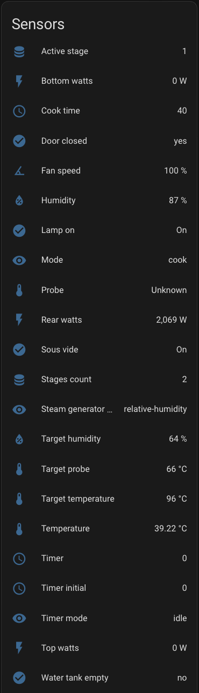

# Anova Oven HA integration

[![GitHub Release][releases-shield]][releases]
[![GitHub Activity][commits-shield]][commits]
[![License][license-shield]](LICENSE)
[![BuyMeCoffee][buymecoffeebadge]][buymecoffee]

This integration relies on the reverse engineering of the Anova Precision Oven WebSocket API as implemented in [this](https://github.com/bogd/anova-oven-api/tree/main) project.

**This integration will set up the following sensors and services.**

Sensors

Services

1. Start cooking
    
2. Stop cooking
    

Events

1. Cook target reached

    Fired when probe or timer was set, and they were reached their target value.

## Installation

### Install from HACS (recommended)

1. Have [HACS][hacs] installed, this will allow you to easily manage and track updates.
2. Add **this** repository to Custom repositories.
3. Search for "Anova oven".
4. Click Install below the found integration.
5. Restart Home Assistant
6. In the HA UI go to "Configuration" -> "Integrations" click "+" and search for "Anova Precision Oven"

### Manual installation

1. Using the tool of choice open the directory (folder) for your HA configuration (where you find `configuration.yaml`).
2. If you do not have a `custom_components` directory (folder) there, you need to create it.
3. In the `custom_components` directory (folder) create a new folder called `anova_oven`.
4. Download _all_ the files from the `custom_components/anova_oven/` directory (folder) in this repository.
5. Place the files you downloaded in the new directory (folder) you created.
6. Restart Home Assistant
7. In the HA UI go to "Configuration" -> "Integrations" click "+" and search for "Anova Precision Oven"

## Configuration is done in the UI

Before do configuration you will need to get access tokens for Anova api.
Detailed instructions how to do it you can find [here](https://github.com/bogd/anova-oven-api/blob/main/docs/README.md).

The Entity configuration allows you to choose the unit of temperature: Celsius or Fahrenheit. 
This will impact the configuration of the “Start cooking” service. 
If you want to change the display format of sensors, you can do it manually for each sensor as shown in the screenshot:

## Contributions are welcome!

If you want to contribute to this please read the [Contribution guidelines](CONTRIBUTING.md)

***

[buymecoffee]: https://www.buymeacoffee.com/andr83
[buymecoffeebadge]: https://img.shields.io/badge/buy%20me%20a%20coffee-donate-yellow.svg?style=for-the-badge
[commits-shield]: https://img.shields.io/github/commit-activity/y/andr83/hacs-anova-oven.svg?style=for-the-badge
[commits]: https://github.com/andr83/hacs-anova-oven/commits/main
[license-shield]: https://img.shields.io/github/license/andr83/hacs-anova-oven.svg?style=for-the-badge
[releases-shield]: https://img.shields.io/github/v/release/andr83/hacs-anova-oven.svg?style=for-the-badge
[releases]: https://github.com/andr83/hacs-anova-oven/releases
[hacs]: https://hacs.xyz